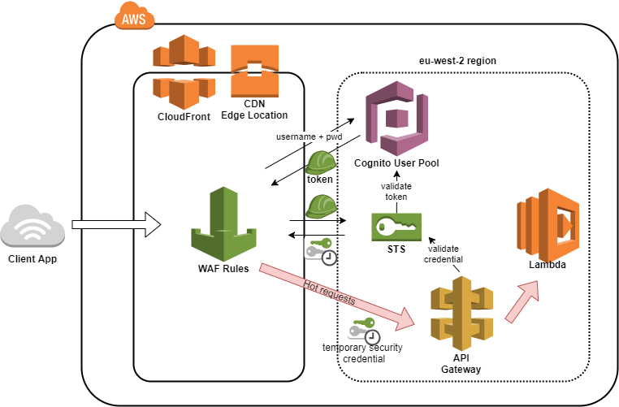

# RESTful external API specification

[](https://travis-ci.org/JiscRDSS/rdss-external-api-spec)

## Introduction

This repository documents the RDSS external API for organisation querying. It describes the API requirements and follows the [current HTTP RFC](https://tools.ietf.org/html/rfc7231) and Level 2 of [Richardson Maturity Model](https://martinfowler.com/articles/richardsonMaturityModel.html).

In order to see the interactive browser RAML viewer, please [click here](https://htmlpreview.github.io/?https://raw.githubusercontent.com/JiscRDSS/rdss-external-api-spec/gh-pages/index.html):

## Audience

The RDSS External API is intended for the following audience:

- Engineering
- Operations
- Quality Assurance

## Versioning

Current version:&nbsp;&nbsp;&nbsp;&nbsp;`0.0.1-SNAPSHOT`

Versioning for the RDSS external API spec follows [Semantic Versioning 2.0.0](http://semver.org/spec/v2.0.0.html).

## Conformance

The keywords **MAY**, **MUST**, **MUST NOT**, **NOT RECOMMENDED**, **RECOMMENDED**, **SHOULD** and **SHOULD NOT** are to be interpreted as described in [RFC2219](https://tools.ietf.org/html/rfc2119).

# Table of Contents

<!-- TOC orderedList:false -->

- [RESTful external API specification](#restful-external-api-specification)
    - [Introduction](#introduction)
    - [Audience](#audience)
    - [Versioning](#versioning)
    - [Conformance](#conformance)
- [Table of Contents](#table-of-contents)
- [Topology](#topology)
- [Schema](#schema)
- [References](#references)

<!-- /TOC -->

# Topology

The API functions will be stored in AWS Lambda and Web clients will call them via a CloudFront distribution URL. Web Application Firewall rules are executed against the incoming requests at CloudFront Edge Locations, and filtered requests are passed to the AWS API Gateway that maps requests to Lambda functions. The results from the functions will be cached according to emitted Cache-Control headers in CloudFront.

 <p align="center">
  
 </p>

AWS Cognito and Security Token Service (AWS STS) simplify the generation of temporary credentials for client apps or services. Cognito User pools will be created to control who or what can access an API Gateway. User pool serves as an identity provider and maintains a user directory. User pools provide user registration, sign-in and access tokens for signed-in users. AWS STS will use access tokens to generate and validate temporary credentials that client apps will use to access an API Gateway.

# Schema

All API access is over HTTPS, and accessed from the https://www.jisc.ac.uk. All data is sent and received as JSON. Client apps use temporary security credentials to sign API requests that is sent in the `Authorisation` HTTP Header. Security token required for validating temporary security credentials is sent as `x-amz-security-token` HTTP Header.

```
curl -i https://www.jisc.ac.uk/organisation
HTTP/1.1 200 OK
Server:
Date: Mon, 03 Aug 2015 17:45:57 GMT
Content-Type: application/json; charset=utf-8
Connection: keep-alive
Status: 200 OK
X-RateLimit-Limit: 100
X-RateLimit-Remaining: 83
X-RateLimit-Reset: 1350085394
Cache-Control: max-age=0, private
```

All timestamps are returned in ISO 8601 format:

```
YYYY-MM-DDTHH:MM:SSZ
```

Please refer to the [api.raml](api.raml) for specification and examples on:

- Versioning
- Caching
- Rate Limiting
- Cross Origin Resource Sharing

# Naming Scheme

Endpoints**MUST**always use plural names to identify them. In keeping with the[Best Practices for Pragmatic RESTful API.](http://www.vinaysahni.com/best-practices-for-a-pragmatic-restful-api#restful)This will avoid grammar conflicts with determining the plurals of words like person/people and maintain consistency in the endpoint. As an example the endpoint `/tickets/1` would provide a single ticket with id 1 while `/tickets` would provide a list of tickets. 

# References

- [REST in Practice](https://www.safaribooksonline.com/library/view/rest-in-practice/9781449383312/)
- [Microsoft API guidelines](https://github.com/Microsoft/api-guidelines/blob/master/Guidelines.md)
- [Restful API design](http://restful-api-design.readthedocs.io/en/latest/intro.html)
- [Richardson maturity model](https://martinfowler.com/articles/richardsonMaturityModel.html)
- [Best Practices For Pragmatic RESTful API](http://www.vinaysahni.com/best-practices-for-a-pragmatic-restful-api#restful)